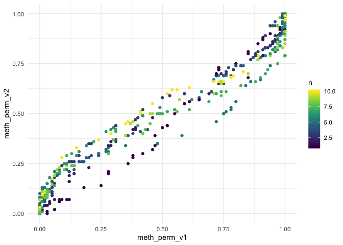

<!-- README.md is generated from README.Rmd. Please edit that file -->

# MethCon5

<!-- badges: start -->

[](https://travis-ci.org/EmilHvitfeldt/methcon5)
[](https://codecov.io/gh/EmilHvitfeldt/methcon5?branch=master)
<!-- badges: end -->

The goal of methcon5 is to identify and rank CpG DNA methylation
conservation along the human genome. Specifically, it includes
bootstrapping methods to provide ranking which should adjust for the
differences in length as without it short regions tend to get higher
conservation scores.

The following
[repository](https://github.com/EmilHvitfeldt/Epigenetic-Conservation-Is-A-Beacon-Of-Function)
includes an analysis in which this package was used.

## Installation

Please note that the name of the package is in all lowercase.

~~You can install the released version of methcon5 from
[CRAN](https://CRAN.R-project.org) with:~~

``` r
install.packages("methcon5")
```

And the development version from [GitHub](https://github.com/) with:

``` r
# install.packages("devtools")
devtools::install_github("EmilHvitfeldt/methcon5")
```

## Example

First we apply the `meth_aggregate` function. This will take the columns
specified in `value` and apply the `fun` stratified according to `id`.
In this case, we want to calculate the mean meth value within each gene.

``` r
library(methcon5)
sample_ii <- fake_methylation %>%
  meth_aggregate(id = gene, value = meth, fun = mean) 

sample_ii
#> # A tibble: 500 x 3
#>     gene  meth     n
#>  * <int> <dbl> <int>
#>  1     1 0.509    10
#>  2     2 0.817     6
#>  3     3 0.577     5
#>  4     4 0.279     9
#>  5     5 0.318     5
#>  6     6 0.427     6
#>  7     7 0.736     4
#>  8     8 0.546     2
#>  9     9 0.328     7
#> 10    10 0.202     6
#> # … with 490 more rows
```

Next we use the `meth_bootstrap` function. This will take the summarized
data.frame calculated earlier along with the original dataset. The
function with return the original data.frame with the new column
attached to the end, which makes it ideal for piping to apply different
methods to the same data.

``` r
adjusted <- sample_ii %>%
  meth_bootstrap(reps = 100) %>%
  meth_bootstrap(reps = 100, method = "perm_v2") %>%
  meth_bootstrap(reps = 100, method = "perm_v3")
adjusted
#> # A tibble: 500 x 6
#>     gene  meth     n meth_perm_v1 meth_perm_v2 meth_perm_v3
#>  * <int> <dbl> <int>        <dbl>        <dbl>        <dbl>
#>  1     1 0.509    10         0.52         0.6          0.39
#>  2     2 0.817     6         0            0.01         0   
#>  3     3 0.577     5         0.28         0.33         0.42
#>  4     4 0.279     9         1            0.91         0.9 
#>  5     5 0.318     5         0.96         0.81         0.76
#>  6     6 0.427     6         0.78         0.69         0.63
#>  7     7 0.736     4         0.05         0.16         0.15
#>  8     8 0.546     2         0.38         0.42         0.54
#>  9     9 0.328     7         1            0.79         0.81
#> 10    10 0.202     6         1            1            0.95
#> # … with 490 more rows
```

``` r
library(ggplot2)

ggplot(adjusted, aes(meth_perm_v1, meth_perm_v2, color = n)) +
  geom_point() +
  scale_color_viridis_c() +
  theme_minimal()
```



## Funding acknowledgments

We gratefully acknowledge funding from NIH awards 1P01CA196569 and R21
CA226106.
